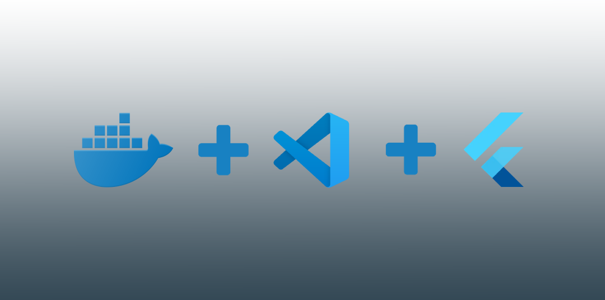

# Flutter and Docker with VS Code



Follow these steps to run a Flutter app on your real device using Docker with VS Code integration

1. install docker on your machine
2. install ```Remote Development``` plugin on Visual Studio Code -> [link here](https://marketplace.visualstudio.com/items?itemName=ms-vscode-remote.vscode-remote-extensionpack)
3. now press F1, write ```> Dev Containers: Reopen in Container``` and press enter. 
VS Code will open a new window with that running container.
4. now inside the terminal of this new window create a new Flutter project ```flutter create demo_app```
5. connect your device via USB and from the same terminal run ```adb devices``` which will print the id of your connected device
6. now run ```cd demo_app```
7. finally run the app with ```flutter run -d [connected device id here] --verbose```